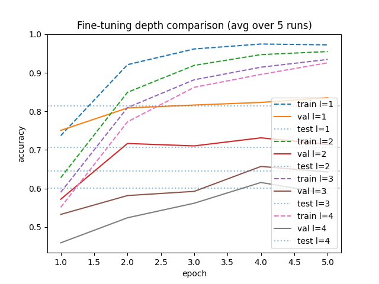

# transfer-learning

A transfer learning project using various extensions.

## Project Structure 

### Root Directory

- /data: dataset files
- /src: Python scripts and modules.
- README.md: Providing an overview and documentation.

## Quick Start
1. Clone the repo and navigate into it:
```bash
git clone git@github.com:johnpeterleo/transfer-learning.git
cd transfer-learning
```

### Install Requirements
```bash
pip install -r requirements.txt
```

### How To Run 

1. Run extract.py

Parses image filenames and builds a pandas DataFrame with metadata (breed, label, file path, image index).
```bash
cd src
python extract.py
```

2. Run beginning.py 
        
Binary transfer learning experiment (Cat vs Dog classification) using the built in dataset from torchvision.datasets.OxfordIIITPet provided by torch, and not extract.py (which can be used for training on imbalanced data). This part uses Adam optimizer with 0.001 learning rate. The old final layer is replaced with "model.fc = nn.Linear(model.fc.in_features, 2)" which means that instead of ResNets 1000 or so outputs, we instead have two for Cat and Dog. Then the replaced final layer is fine-tuned with pet datasets training data.
```bash
cd src
python beginning.py
```
      

Producing these accuracies for one run:
```bash
train loss: 0.0545 acc: 0.9830
Training done in 2m 7s
Best val acc: 0.9959
Test accuracy: 0.9875
```

And this graph for validation and training accuracy:


3. Run multi_class.py 
        
Multi-class transfer learning experiment for all 37 pet breeds using the built in dataset from torchvision.datasets.OxfordIIITPet provided by torch, and not extract.py (which can be used for training on imbalanced data). This part uses Adam optimizer with 0.001 learning rate. The replaced final layer (37 output instead of resnets own 1000 or so outputs) is fine-tuned with pet datasets training data.
```bash
cd src
python multi_class.py
```
        
Producing these accuracies during training for one run:
```bash
train loss: 0.2965 acc: 0.9317

Training done in 2m 8s
Best val acc: 0.8913
Test accuracy: 0.8689
```

And this graph for validation and training accuracy:


4. Run fine_tune_l_layers.py 
        
Multi-class transfer learning experiment for all 37 pet breeds using the built in dataset from torchvision.datasets.OxfordIIITPet provided by torch, and not extract.py (which can be used for training on imbalanced data). This part uses Adam optimizer with 0.001 learning rate. The replaced final layer (37 output instead of resnets own 1000 or so outputs) is fine-tuned with pet datasets training data. The major difference between this experiment and the previous one, i.e. multi_class.py, is that this code also trains the lower levels in iterations (not only the final fully-connected classification layer) for 4 different models in total such that we can compare the final accuracy.
```bash
cd src
python fine_tune_l_layers.py 
```

Producing these accuracies during training for one run:
```bash
l = 1: Test accuracy: 0.8277
l = 2: Test accuracy: 0.6934
l = 3: Test accuracy: 0.6803
l = 4: Test accuracy: 0.6225
```


And this graph for validation and training accuracy accross the models:


## Contact
John Christensen - johnchristensen@outlook.com


Lidya Nasser -   


August Filannino -       


Samy Zouggari - 